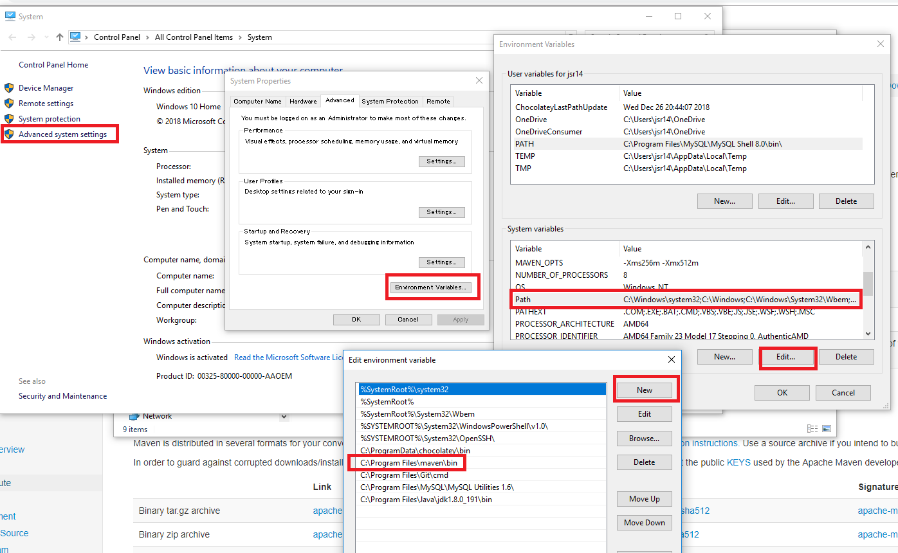

To run the spring-boot application, need to follow some step.

Maven setup (ignore if already setup):

a) Install maven from https://maven.apache.org/download.cgi

b) Unzip maven and keep in C drive (you can keep any location. Path location will be changed accordingly).

c) Set MAVEN_HOME in system variable. 

d) Set path for maven

e) Move to your application folder

    cd \your\application\folder\userService

f) Build Spring Boot Project with Maven

    mvn clean package -DskipTests
or

      mvn install / mvn clean install -DskipTests

g) Run Spring Boot app using Maven:

     start mvn spring-boot:run -Dspring-boot.run.arguments="--DB_USERNAME=ask_koushik --DB_PASSWORD=ask_koushik --AWS_SECRET_KEY=ask_koushik --AWS_ACCESS_KEY=ask_for_the_key"
h) Now goto below URL to get the api documentation.

      http://localhost:9000/swagger-ui.html
i) To stop press

    CTRL+C